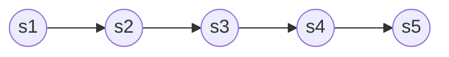
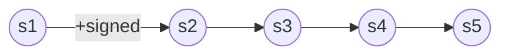
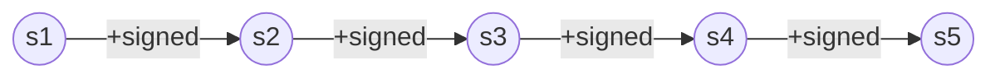

Fixed point operators allow us to write rules that are applied repeated throughout a model.

## Root State of Rule

So far, we've seen simple rules using boxes and diamonds. Each of time a rule is applied, it is applied relative to current state of the model. This state becomes known and the root state of the rule. If we need a rule to also apply to subsequent states, we'd need a longer rule. For example, consider a model of 5 sequential states, where we are in the first state:



If we apply the rule, `[-signed]false`, then the model will need to evolve to constrain only the first arrow, but not the rest:



We could conjoin subrules to produce a rule that applies to the model's subsequent transitions, but at the cost of becoming painfully verbose:

```
[-signed]false and [][-signed]false and [][][-signed]false and [][][][-signed]false
```



But how can we get a rule to apply no matter how many transitions occur?

## Greatest Fixed Point

`gfp`

## Least Fixed Point

`lfp`