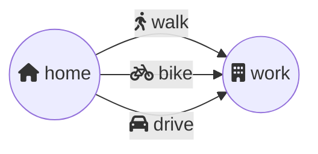
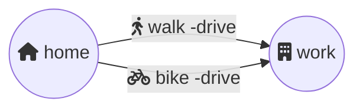

In Modality, we specify that a certain behavior is either necessary or possible, using boxes `[ ]` and diamonds `< >`.

## Box `[ ]` means necessity along a path

Consider the following model, showing that to from home to work we may either walk, bike, or drive.

Now let's say, we want to write a rule in Modality to restrict our commute options. Here's a rule that says we may not drive to work:

`[drive] false`

The square brackets around the word "drive" is called a box and conveys necessity. In this case, the box is telling us that this rule applies to commuting paths that necessitate driving.

The second word `false` is a boolean value (as in `true` or `false`) that tell us how to evaluate our rule. In this case, a final `false` tells us that the rule is broken by any path that requires us to drive.

To satisfy this new rule, the model must evolve to no longer allow driving to work:

Note the the arrow for driving to work is now gone. You'll also see that `-drive` has been included on the other arrows. This prevent scenarios where we both drive and bike or walk to work.

So what if we wanted a rule to require walking to work? Which of these two rules requires us to walk?

<code>[walk] true</code>

 

Sorry, wrong answer. <code>true</code> after <code>[walk]</code> means that any path including walking should be true, but it also doesn't restrict other paths.

<code>[-walk] false</code>

 

Great job! <code>false</code> after <code>[-walk]</code> means that any path not including walking should be false.

## Diamond `< >` means possibility along a path