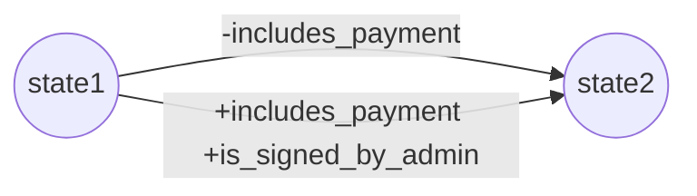

We write rules in Modality to constrain the future outcomes of a DotContract. When changes are committed to a contract, we use models to confirm that the rules remain satisfied.

## Rules

A rule constrains the future outcomes of a contract. For example, a rule may require that two parties sign for a payment to occur.

Each DotContract starts off with an empty set of rules. To add rules, you commit them to a contract.

Adding rules is append-only, meaning once a rule is added, it may not be removed.

<note>
If you want a rule to become non-effective at some later point, it can include a revocation process, after which the rule's effect is gone. Your revoked rule will still remain on the rule list but will no longer have an effect on the contract.
</note>

## Models

Every time we commit changes to a contract, a model is used to confirm that those changes satisfy the rules of the contract.

Our models are graphs of states connected by arrows. Each commit is a transition between states along an arrow. Transitioning along an arrow implies that the rules remain satisfied.

Each arrow is a labelled set of pseudo-booleans propositions (true, false, maybe), represented by +, -, or omission.

<note>

```
+  means that a proposition must be true

-  means that a proposition must be false

0  means that a proposition can be either true or false
   this is the default if a proposition doesn't appear
```

</note>

Let's construct an example model that allows commits that are either a) without a payment or b) with a payment and also signed by the admin.



DotContract comes with tools to help create your models automatically for you, and in most cases, you will only need to write rules.

## Rules versus Models

In Modality, the rules of a contract are respected as canon, while models are always subject to change. You can think of the model as a user submitted interpretation of the rules. It may be inefficient or it may be overly restrictive. What you can be sure of is that if a contract accepts a model then it satisfies the rules.

Each contract use a [Kripke Machine](/docs/concepts/kripke-machine) to maintain the integrity of a contract. The Kripke Machine works by tracking the contract state and doing model checking. If at any point a user submits a rule breaking model, then the Kripke Machine will reject it.

## Model Evolution

At first a contract has no rules and any model will satisfy it. Over time, as rules are collected, our model will need to evolve. Each time a model changes a user is responsible for submitting an evolution. That evolution will connect the past model to the evolved model, allowing for a continuity of a contract's state. DotContract comes with tools to help create your evolutions for you automatically.